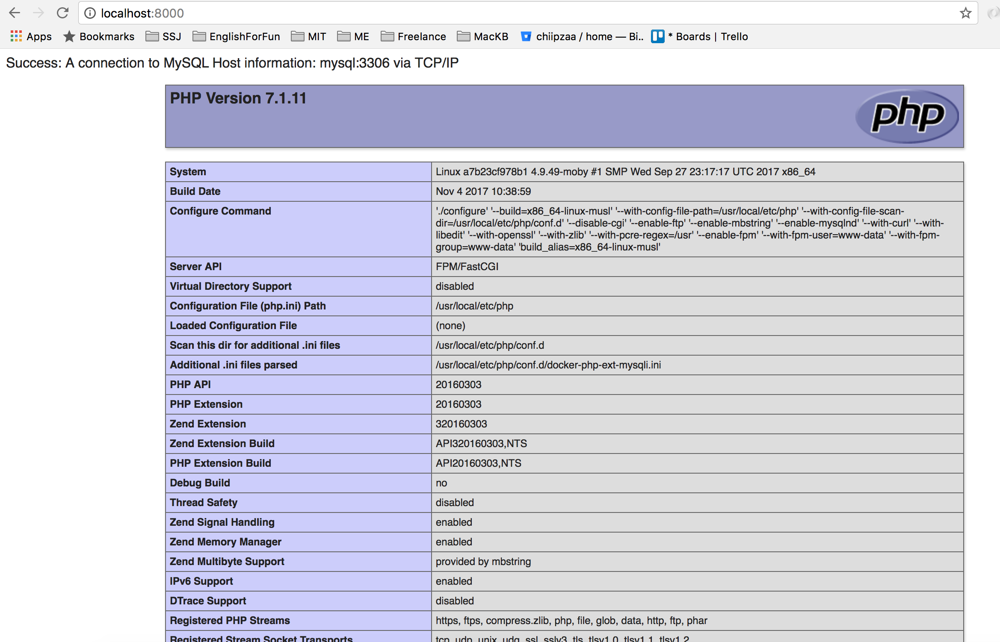
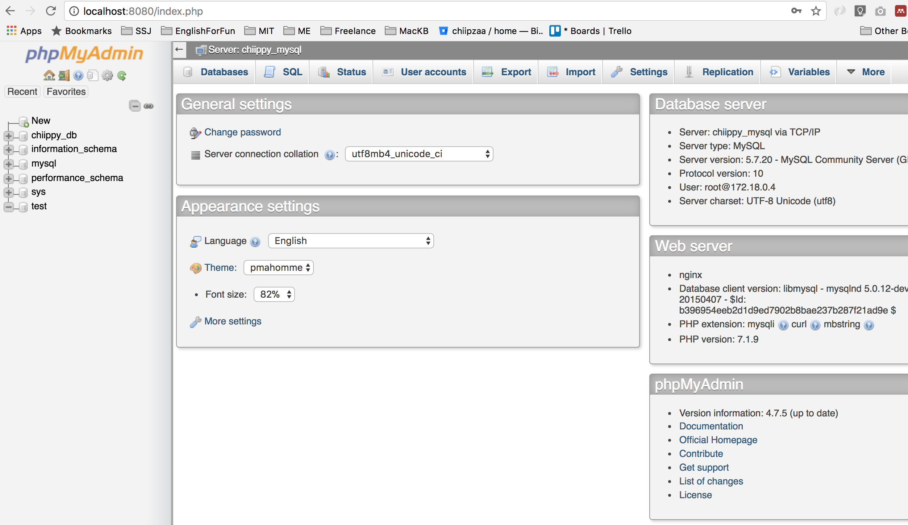

# Dock#1 : Webserver ด้วย php7, mysql, nginx and phpmyadmin

## #1 เตรียม Folder Project 
สร้าง Folder ตามนี้ก่อนเลย
``````
Docker1 (root project)
├── mysql
├── nginx
│ └── default.conf
├── www
│ └── index.php
├──docker-compose.yml
``````
## #2 ต่อมา
แก้ไข File: *docker-compose.yml* พิมพ์คำสั่งตามนี้
 ``````
version: '3'
services:
    nginx:
        image: nginx:latest
        container_name: chiippy_nginx
        ports:
            - 8000:80
        volumes:
            - ./nginx/default.conf:/etc/nginx/conf.d/default.conf:ro
            - ./www:/var/www/html
        depends_on:
            - php
            - mysql
        restart: always    

    php:
        build: ./php
        container_name: chiippy_php
        volumes:
            - ./www:/var/www/html
            - ./php/php.ini:/usr/local/etc/php/conf.d/php.ini:ro
        restart: always

    phpmyadmin:
        image: phpmyadmin/phpmyadmin
        container_name: chiippy_phpmyadmin
        ports:
            - 8080:80
        environment:
            - PMA_ARBITRARY=1
            - PMA_HOST=chiippy_mysql
        depends_on:
            - mysql
        restart: always    

    mysql:
        image: mysql
        container_name: chiippy_mysql
        volumes:
            - ./mysql:/var/lib/mysql        
        environment:
            - MYSQL_DATABASE=chiippy_db
            - MYSQL_ROOT_PASSWORD=root
            - MYSQL_USER=chiippy_user
            - MYSQL_PASSWORD=chiippy_pass
        ports:
            - 3306:3306
        restart: always
 ``````
 เตรียม container เสร็จแล้ว

## #3 ต่อมา ว่ากันด้วยเรื่อง Web
ที่ไฟล์ *index.php* เพิ่ม code
``````
<?php echo phpinfo();?>
``````
ที่ไฟล์ *default.conf*
``````
server {
    listen 80 default_server;
    listen [::]:80 default_server;
    server_name localhost;

    root /var/www/html;
    index index.php index.html;
    error_log  /var/log/nginx/error.log;
    access_log /var/log/nginx/access.log;
    
    location ~ \.php$ {
        try_files $uri =404;
        fastcgi_split_path_info ^(.+\.php)(/.+)$;
        fastcgi_pass php:9000;
        fastcgi_index index.php;
        include fastcgi_params;
        fastcgi_param SCRIPT_FILENAME $document_root$fastcgi_script_name;
        fastcgi_param PATH_INFO $fastcgi_path_info;
    }
}
``````

## #4 มาทดสอบครั้งแรกกัน
``````
docker-compose up -d
``````
รอ ให้ docker ทำงานเอง โดยมันจะเช็กว่ามี image มีในเครื่องหรือยัง และมันจะทำการ download image ตามที่เราระบุ และสร้าง container ตามชื่อที่เรากำหนด ก็จะแสดงประมาณนี้

## #5 ลองเข้าหน้าเว็บดู

ลองเข้า localhost:8000


ลองเข้า localhost:8080


เสร็จแล้ว เหมือนจะดูวุ่นวาย แต่ใช้ไปก็จะชินไปเอง

## หากทำตามแล้วไม่ได้ ก็ Clone Folder นี้ไป
แล้วใช้คำสั่ง
``````
docker-compose up -d
``````


