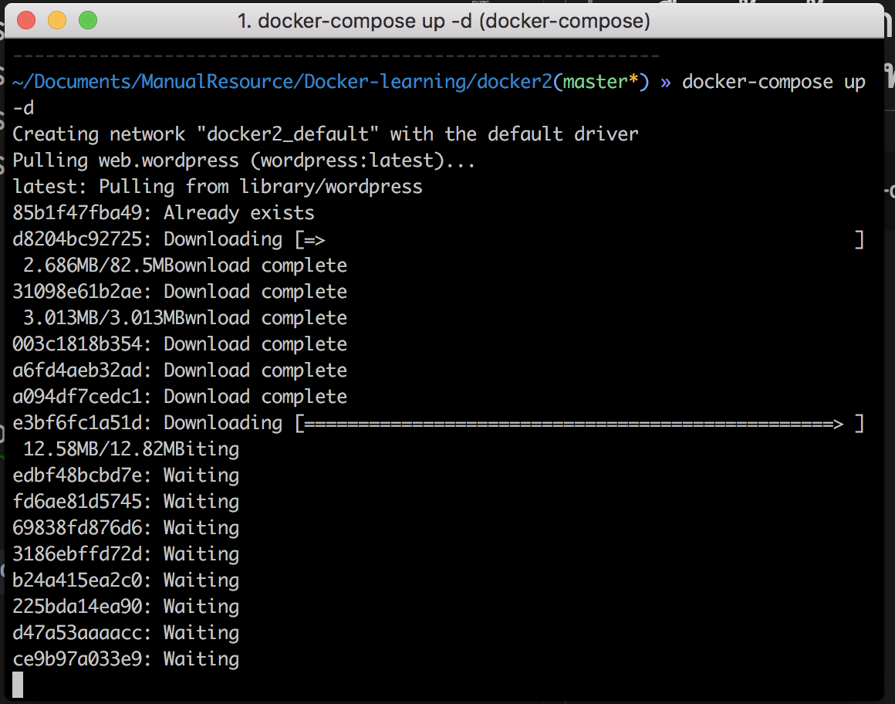
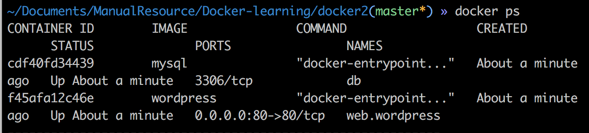
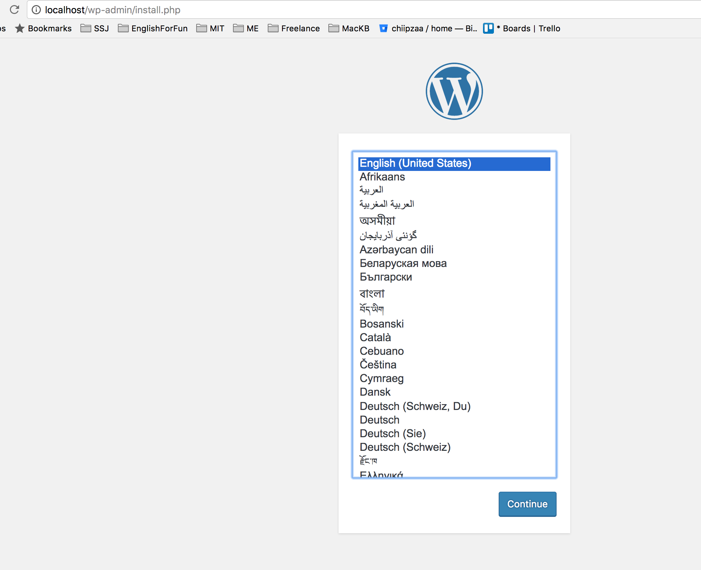

# Docker #2 : Docker รวมร่าง Wordpress พร้อมใช้

- เครื่อง Development กับ Production ไม่เหมือนกัน 
- เสียเวลา ติดตั้งและ Config Server Application เมื่อต้องการใช้งาน WordPress บน Server สักตัวนึง จะต้องติดตั้ง Application ต่างๆมากมายในฝั่ง Server รวมถึงการแก้ Config มากมายเพื่อให้ Application ทำงานได้ตามที่เราต้องการ บางทีแค่ setup ก็เสียเวลากันเป็นวันๆ

# ใช้พลังของ docker-compose.yml สร้างไฟล์มันขึ้นมา
`````
Docker2 (root project)
├──docker-compose.yml
``````

ตั้งค่า docker-compose.yml โดยในไฟล์นี้ก็จะประกอบไปด้วย MySQL และ Wordpress
``````
version: '2'
services:
  db:
    container_name: db
    image: mysql
    restart: always
    environment:
       - MYSQL_USER=root
       - MYSQL_ROOT_PASSWORD=abc123
       - MYSQL_DATABASE=web.wordpress
  web.wordpress:
    container_name: web.wordpress
    image: wordpress
    environment:
       - WORDPRESS_DB_HOST=db
       - WORDPRESS_DB_USER=root
       - WORDPRESS_DB_PASSWORD=abc123
       - WORDPRESS_DB_NAME=web.wordpress
    ports:
       - 80:80
    restart: always
``````

# ลงมือสร้างด้วยการใช้ Docker-compose ทำการ Build และ Run ไฟล์
``````
docker-compose up -d
``````
รอสักครู่ หากไม่มีไฟล์ images ก็จะดาวโหลดมา


หลังจากนั้นก็ตรวจสอบสถานะ สักหน่อย ด้วย
``````
docker ps
``````


ทดสอบเปิดหน้าเว็บซิ รอรัยอยู่ ที่ *localhost*


เป็นงัยล่ะ การติดตั้ง WordPress อย่างง่าย ในเวลาเพียงแปปเดียว และด้วยพลังของ Docker 
