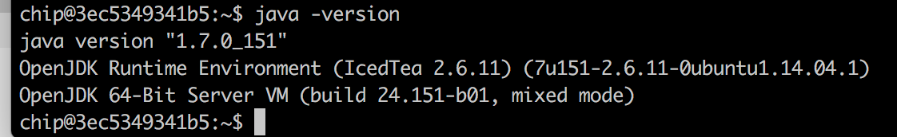
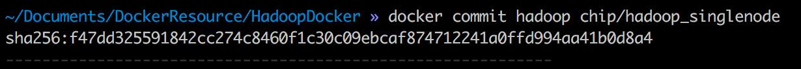
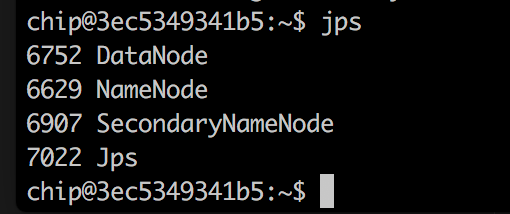
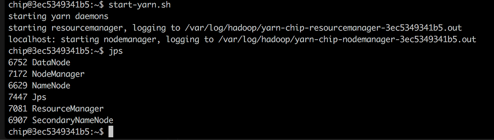
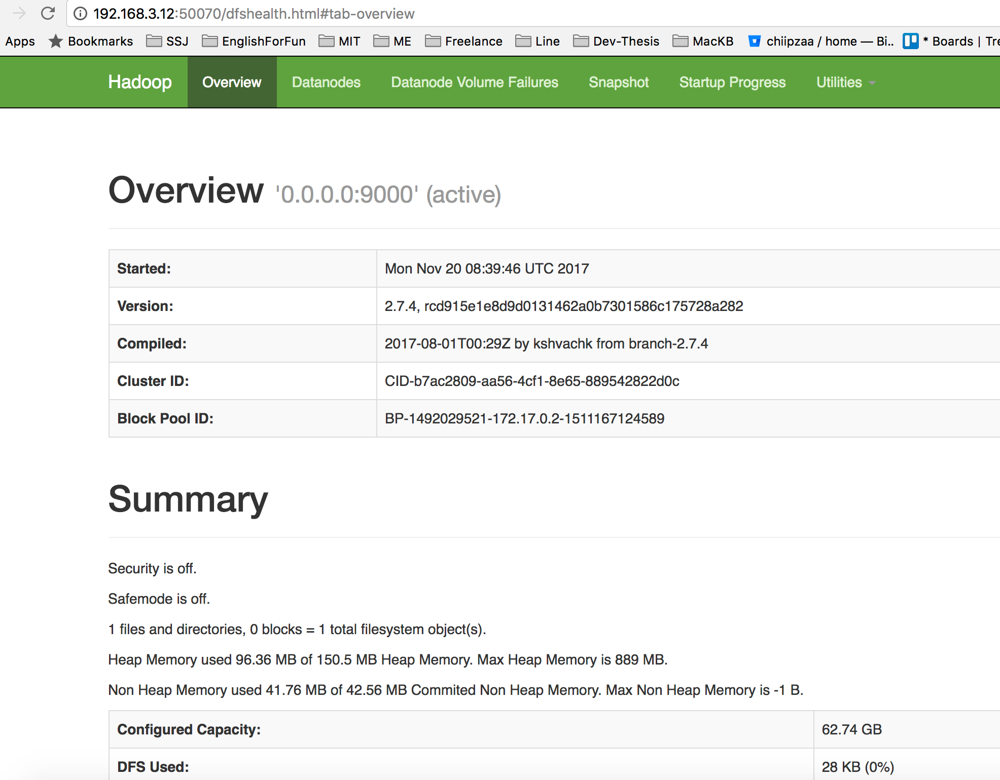

# ติดตั้ง Hadoop แบบ Single-Node Cluster

Hadoop แบบ Single-Node Cluster คือ Master Node และ Slave Node จะทำงานอยู่บนเครื่อง Computer เครื่องเดียวกัน

ถ้า “ปิดเครื่อง” ไปแล้ว ให้เข้า terminal ตรวจสอบว่ามี container process เดิมค้างอยู่หรือเปล่า
``````
docker ps -a
``````
ถ้าขึ้นและมี STATUS เป็น “Exited …” ให้ทำการ clear process เดิมเสียก่อน
``````
docker rm -f ubuntu
``````
แล้วเริ่มต้นเสียใหม่นะ
``````
docker run -d -p 2222:22 --name ubuntu rastasheep/ubuntu-sshd
``````

เริ่ม Hadoop สักที 555++
- ### สร้าง User สำหรับ Hadoop ที่จะใช้ใน ubuntu ###

ให้ทำการสร้าง user สำหรับเป็น owner ของ hadoop
สร้าง ubuntu user : “chip” , ใส่ password เป็น “[s]ystem”
``````
useradd chip
passwd chip
# หลังจากนั้นจะมีให้ใส่รหัสผ่าน
``````

สร้าง home directory และใส่ user chip เข้าสู่ group sudo
``````
mkhomedir_helper chip
usermod -aG sudo chip
``````

### จากนั้นให้ออกจาก ssh และ re-login ด้วย user: chip แทน ###
``````
user: chip
password: [s]ystem
``````

- ### สร้าง SSH Channel ในการติดต่อของ Hadoop
 ###
สร้าง Public Key เพื่ออนุญาตให้แต่ละ Node ของ Hadoop สามารถคุยกันได้อย่างอัตโนมัติ ซึ่งจะมีประโยชน์โดยที่เราไม่ต้องมาใส่ password แบบ manual ทุก ๆ ครั้ง
``````
ssh-keygen -t rsa -P "" -f ~/.ssh/id_rsa
``````

ให้ copy Public key
``````
cat $HOME/.ssh/id_rsa.pub >> $HOME/.ssh/authorized_keys
``````

เรียก bash shell จะได้ prompt ที่มี user ของเรา
``````
bash
``````
ให้ทดสอบการเชื่อมต่อ ssh ซึ่งถ้ามีคำถามให้ตอบ “yes”
``````
ssh localhost
``````

ให้สังเกตุว่า shell prompt จะเปลี่ยนไปจาก “chip@dfc78850c159:” เป็น “$” แสดงว่าสามารถใช้งาน SSH Channel ได้แล้ว
ให้พิมพ์ exit เพื่อออกมาที่ shell prompt เดิมของเรา
``````
exit
``````

************** พักยก **************

## ติดตั้ง JAVA (ในนี้เราติดดั้ง Java JDK version 7 )
``````
sudo apt-get update
sudo apt-get install openjdk-7-jdk
``````

เพิ่ม JAVA_HOME ใน file “.bashrc” (ใช้ nano ใช้ vi ไม่เป็น 555+)
``````
export JAVA_HOME=/usr/lib/jvm/java-7-openjdk-amd64
export PATH=$PATH:$JAVA_HOME/bin
``````

ติดตั้ง nano
``````
sudo apt-get install nano
``````

ทดสอบว่า Java ทำงานได้แล้วหรือยัง
``````
source .bashrc
java -version
``````


## เริ่มขั้นตอนการติดตั้ง Hadoop สักทีนะ

- สร้าง Hadoop Directory สำหรับเก็บ program และ log
``````
sudo mkdir -p /usr/local/hadoop
sudo chown chip:chip -R /usr/local/hadoop
sudo mkdir /var/log/hadoop
sudo chown -R chip:chip /var/log/hadoop
``````

- สร้าง Directory Name Node และ Data Node
``````
sudo mkdir -p /var/hadoop_data
sudo mkdir -p /var/hadoop_data/namenode
sudo mkdir -p /var/hadoop_data/datanode
sudo chown chip:chip -R /var/hadoop_data
``````

- Download File setup Hadoop
``````
wget http://www-eu.apache.org/dist/hadoop/common/hadoop-2.7.4/hadoop-2.7.4.tar.gz
``````

******** พักยก ********
Save state กันสักรอบ
``````
docker commit hadoop chip/hadoop_singlenode
``````


******** ลุยต่อ สบายใจหน่อยแล้ว ********

- ให้แตก file ที่ดาวห์โหลดมา และ ย้าย file ไปยัง Hadoop directory
``````
tar -xvf hadoop-2.7.4.tar.gz
cd hadoop-2.7.4/
sudo mv * /usr/local/hadoop
cd
``````

กำหนด HADOOP_HOME ใน environment ใน file: .bashrc
``````
nano .bashrc

# เพิ่ม
export HADOOP_HOME=/usr/local/hadoop
export PATH=$PATH:$HADOOP_HOME/bin
export PATH=$PATH:$HADOOP_HOME/sbin
``````

เรียกใช้งาน environment ที่ setup เหมือนการ รีเฟรช ค่าที่เพิ่งเพิ่มเข้าไป
``````
source .bashrc
``````

- การแก้ไขค่าที่สำคัญต่าง ๆ
เพิ่มข้อความการเพื่อ set Hadoop environment ท้าย
> /usr/local/hadoop/etc/hadoop/hadoop-env.sh
``````
export JAVA_HOME=/usr/lib/jvm/java-7-openjdk-amd64
export HADOOP_LOG_DIR=/var/log/hadoop
``````

เพิ่มข้อความการ set YARN environment ท้าย file 
> /usr/local/hadoop/etc/hadoop/yarn-env.sh
``````
export YARN_LOG_DIR=/var/log/hadoop
``````

แก้ไข file:
> /usr/local/hadoop/etc/hadoop/core-site.xml
``````
<configuration>
 <property>
  <name>fs.defaultFS</name>
  <value>hdfs://0.0.0.0:9000</value>
 </property>
 <property>
  <name>hadoop.proxyuser.root.hosts</name>
  <value>*</value>
 </property>
 <property>
  <name>hadoop.proxyuser.root.groups</name>
  <value>*</value>
 </property>
</configuration>
``````

แก้ไข file :
> /usr/local/hadoop/etc/hadoop/hdfs-site.xml
``````
<configuration>
 <property>
  <name>dfs.replication</name>
  <value>1</value>
 </property>
 <property>
  <name>dfs.namenode.name.dir</name>
  <value>file:/var/hadoop_data/namenode</value>
 </property>
 <property>
  <name>dfs.datanode.data.dir</name>
  <value>file:/var/hadoop_data/datanode</value>
 </property>
 <property>
  <name>dfs.namenode.acls.enabled</name>
  <value>true</value>
 </property>
</configuration>
``````

แก้ไข file : 
> /usr/local/hadoop/etc/hadoop/yarn-site.xml
``````
<configuration>
 <property>
  <name>yarn.resourcemanager.hostname</name>
  <value>0.0.0.0</value>
 </property> 
 <property>
  <name>yarn.resourcemanager.scheduler.address</name>
  <value>0.0.0.0:8030</value>
 </property>
 <property>
  <name>yarn.resourcemanager.resource-tracker.address</name>
  <value>0.0.0.0:8031</value>
 </property>
 <property>
  <name>yarn.resourcemanager.address</name>
  <value>0.0.0.0:8032</value>
 </property>
 <property>
  <name>yarn.resourcemanager.admin.address</name>
  <value>0.0.0.0:8033</value>
 </property>
 <property>
  <name>yarn.resourcemanager.webapp.address</name>
  <value>0.0.0.0:8088</value>
 </property>
 <property>
  <name>yarn.nodemanager.aux-services</name>
  <value>mapreduce_shuffle</value>
 </property>
 <property>
  <name>yarn.nodemanager.aux-services.mapreduce_shuffle.class</name>
  <value>org.apache.hadoop.mapred.ShuffleHandler</value>
 </property>
</configuration>
``````

สร้าง file: 
> /usr/local/hadoop/etc/hadoop/mapred-site.xml
``````
<configuration>
 <property>
  <name>mapreduce.framework.name</name>
  <value>yarn</value>
 </property>
</configuration>
``````

### ถึงจุดสำคัญแล้ว ###
``````
# format name node
hdfs namenode -format

# Start HDFS
start-dfs.sh

# HDFS Process
jps
``````

ถ้าถูกต้อง เราจะได้ 4 process เย้ ๆๆ ได้แก่ DataNode , NameNode, SecondaryNameNode และ Jps


ต่อไปก็ start YARN
``````
# start YARN
start-yarn.sh

# YARN Process
jps
``````
ก็จะได้ process เพิ่มเข้ามา


โอ้วว....เรียบร้อย ! 5 Process (HDFS 3 + YARN 2) ขึ้นแสดงว่าเราสามารถ setup Hadoop แบบ Single-Node Cluster ได้สำเร็จแล้ว


อย่าลืม Save state ที่ทำเสร็จแล้วไว้ด้วยนะ

> Note

อ้าวววว....... JDK7 run ไม่ได้ เลยต้องเปลี่ยนเป็น JDK8
``````
# remove
sudo apt-get purge openjdk*

# install
sudo add-apt-repository ppa:webupd8team/java
sudo apt-get update

sudo apt-get install oracle-java8-installer

# environment
# JAVA_HOME="/usr/lib/jvm/java-8-oracle"
``````

